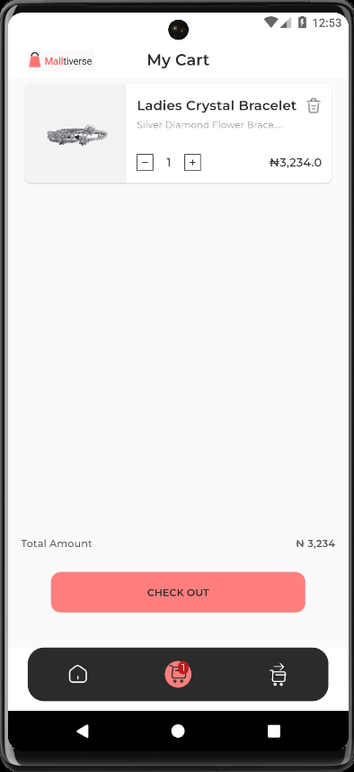
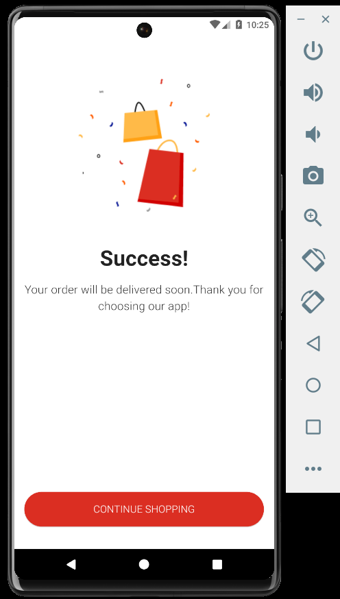
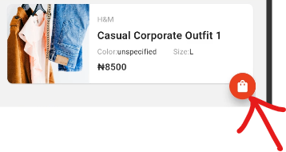

# Simple Shopping App

## Overview

This is a simple shopping app built using Flutter, showcasing a list of products and a checkout screen. The app demonstrates basic functionality such as adding and removing items from the checkout cart and navigating to an order successful screen.

## Features

- Bottom navigation bar with Products and Checkout items.
- Static list of products/items displayed under the Products tab.
- Checkout tab displaying the products added for checkout.
- Functionality to add and remove items from the checkout cart.
- Button to navigate to an Order Successful screen from the Checkout screen.

## Screenshots





## Getting Started

These instructions will get you a copy of the project up and running on your local machine for development and testing purposes.

### Prerequisites

- [Flutter SDK](https://flutter.dev/docs/get-started/install)
- [Android Studio](https://developer.android.com/studio) or [Visual Studio Code](https://code.visualstudio.com/) with Flutter and Dart plugins

### Installation

1. Clone the repository
   ```bash
   git clone https://github.com/krysnkem/hng11-shoping-app.git
   ```

2. Navigate to the project directory:
   ```bash
    cd hng11-shoping-app
   ```
3. Install the necessary dependencies:
   ```bash
    flutter pub get
   ```
4. Run the application:
   ```bash
    flutter run
   ```


## Test App

You can try out the app [here](https://appetize.io/app/afktgiaqkfl3d36pachcy6rp2a?device=pixel7&osVersion=13.0) on Appetize.io.

To add to cart
- Click 
- Click on the the bag icon at the second tab